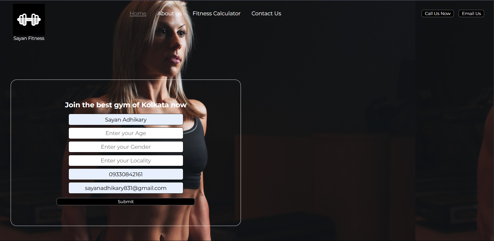

<h1>Gym Fitness Project</h1>

This repository contains a simple gym fitness website built using HTML and CSS.  The project aims to create a responsive and visually appealing website for a fictional gym or fitness center.

<h1>Table of Contents</h1>
<ul>  
 <li>Demo</li>
 <li>Features</li>
 <li>Installation</li>
 <li>Usage</li>
 <li>Contributing</li>
 <li>License</li>
</ul>
<h1>Demo</h1>

<h1>Features</h1>

The Gym Fitness Website includes the following features:

<ul>
 <li>Home page with an introduction to the gym</li>
 <li>Services section highlighting different fitness programs</li>
 <li>Class schedule and timetable</li>
 <li>Contact page with a form for inquiries</li>
 <li>Responsive design for various screen sizes</li>
</ul>
<h1>Installation</h1>

Clone this repository:git clone https://github.com/leoGoD10/gym-fitness-project.git

